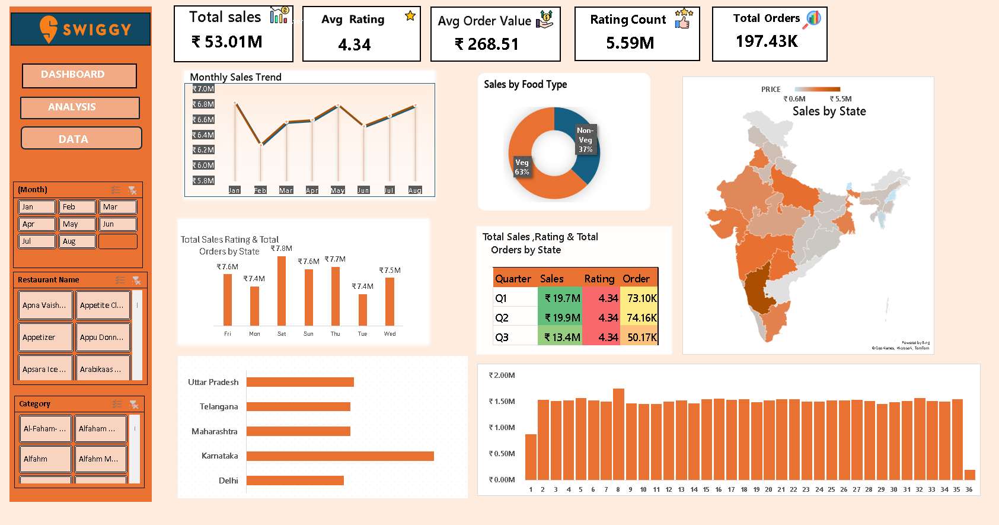

# Swiggy Sales Analysis Dashboard

## Project Overview
This project is an interactive sales analysis dashboard built using Microsoft Excel.  
The goal of the project is to analyze Swiggy sales data and extract useful business insights such as sales trends, food preferences, and state-wise performance.

## Tools Used
- Microsoft Excel
- Pivot Tables
- Pivot Charts
- Slicers
- Data Visualization

## Key Metrics
- Total Sales: ₹53.01M
- Total Orders: 197K
- Average Rating: 4.34
- Average Order Value: ₹268.51

## Dashboard Features
- Monthly Sales Trend
- Sales by Food Type (Veg vs Non-Veg)
- State-wise Sales Analysis
- Order Trends
- Interactive Filters

## Dashboard Preview

## Insights
- Veg food contributes a major share of orders
- Some states generate higher revenue than others
- Order patterns vary across different days
